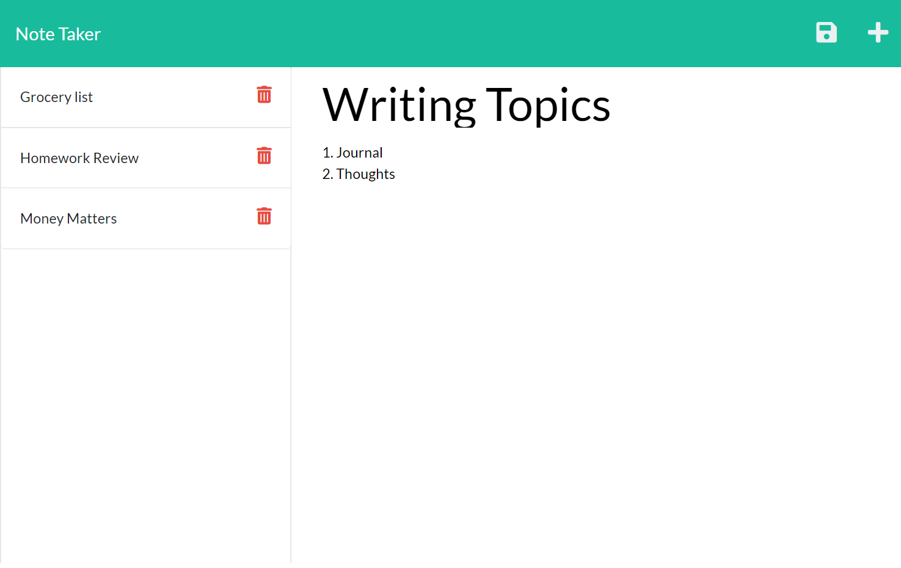

# NoteTaker

Hosted on heroku at https://immense-sierra-03740.herokuapp.com/

## Description

Simple note taking application deployed in Heroku with a single json as the database.

## Table of Contents

- [Installation](#installation)
- [Usage](#usage)
- [Demo](#demo)
- [Contributing Guidelines](#contributing-guidelines)
- [Tests](#tests)
- [License](#license)
- [Questions](#questions)

## Installation

npm install

## Usage

npm start

## Demo

## Contributing Guidelines

[Contributor Covenant](https://www.contributor-covenant.org/)

## License

This application is covered under the MIT license. [Link to license.](./LICENSE.txt)

## Questions

[My Github Profile](https://github.com/Disha2022)

If you have additional questions, I can be reached by raising a github issue.
